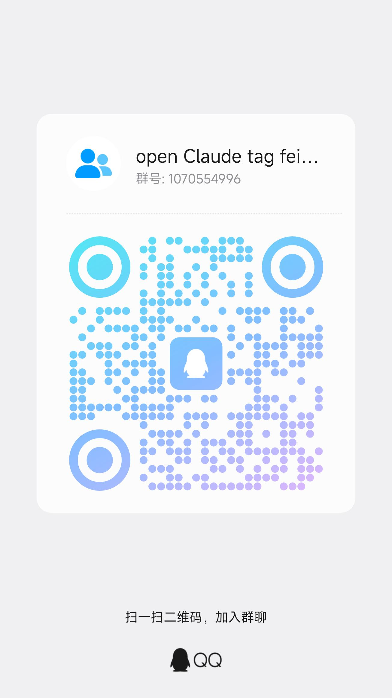
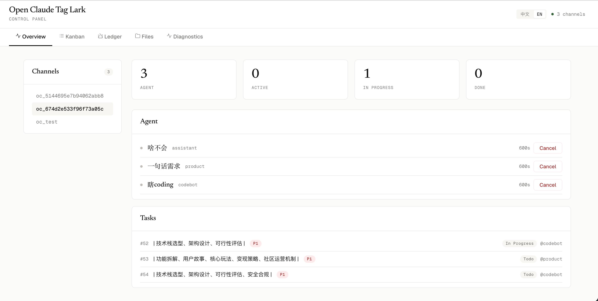
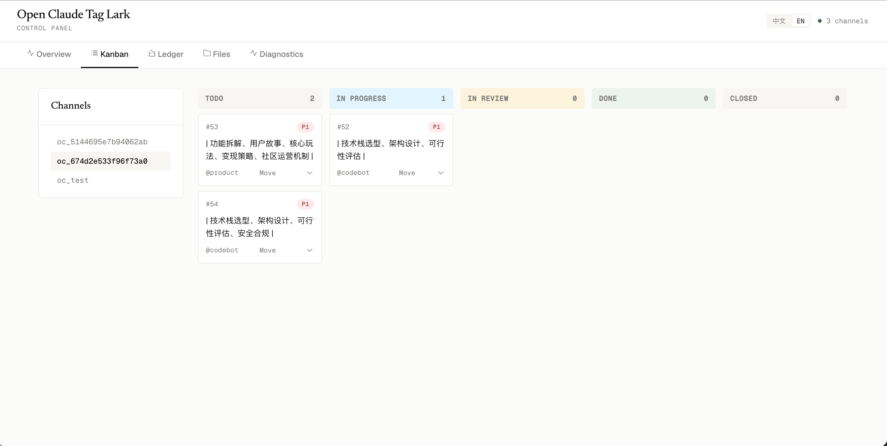
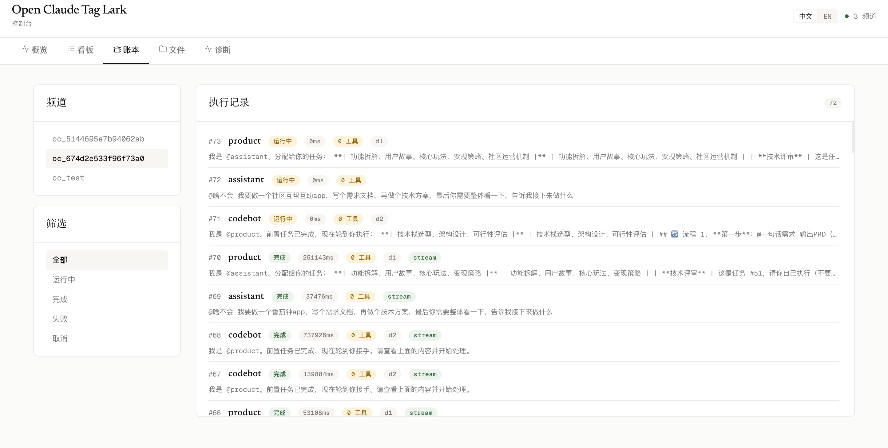
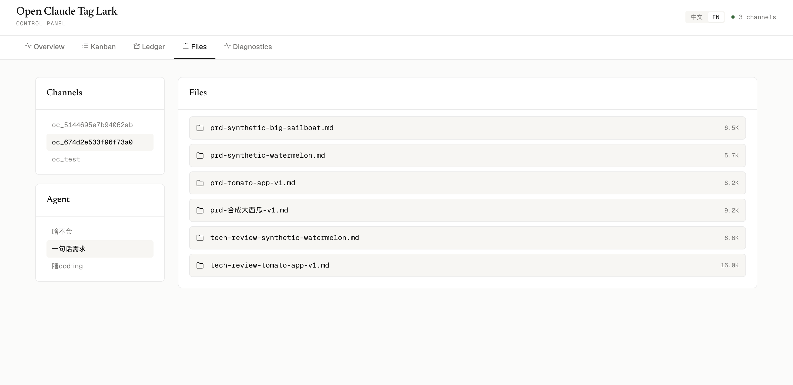

<p align="center">
  <a href="./README.md">简体中文</a> · <b>English</b>
</p>

# Open Claude Tag Lark — The open-source Claude Tag for the Feishu ecosystem

> Bringing Anthropic Claude Tag's "shared channel AI teammate" concept to Feishu. One digital employee per group, shared memory for all, multi-agent auto-collaboration.

<p align="center">
  <a href="./LICENSE"></a>
  
  
  
  
</p>

---

## Join the Community

<table align="center">
  <tr>
    <td align="center">
      <br />
      <b>Scan to join the QQ group</b>
    </td>
    <td align="center">
      <br />
      <b>Add me on WeChat</b>
    </td>
  </tr>
</table>

<!-- TODO: place the two QR code images into the assets/ directory:
     - assets/qq-group-qr.jpg  (QQ group QR code)
     - assets/wechat-qr.jpg    (WeChat QR code)
-->

---

## What is this

[Anthropic Claude Tag](https://www.anthropic.com/news/introducing-claude-tag) introduced a revolutionary idea: AI shouldn't be a personal assistant in DMs, but a **shared teammate in a channel** — one agent per channel, everyone shares the same memory, the agent knows who said what, remembers past conclusions, and proactively follows up on unfinished business.

But Claude Tag is closed-source, paid, locked to Anthropic models, and only available in Slack.

**Open Claude Tag Lark is the open-source replica, built for the Feishu ecosystem**:

- **Digital employees, not chatbots** — each agent is a "digital employee" with identity, memory, and expertise, collaborating in groups like a real coworker
- **Multi-employee auto-collaboration** — primary agent `@delegates` subtasks to specialized agents (product expert, code expert...); the runtime builds dependency chains, wakes agents in order, and tracks every task
- **Isolated sandbox execution** — built-in OpenSandbox code execution: agents run Python/JS/Go, read/write files, install packages in isolated containers, state persists within a session
- **Three-layer memory that scales** — global knowledge / task progress / current conversation stored separately, embedding retrieval pulls only what's relevant — no more full memory dumps slowing down every turn
- **Deep Feishu integration** — built on lark-oapi long connection, interactive card streaming output, multi-bot identity, @username auto-parsing — native experience, no friction
- **Fully extensible** — LLM-agnostic (one config line switches Claude/GPT/DeepSeek/Ollama), MCP tool ecosystem (any MCP server plugs in instantly), file-based config (git-manageable), self-hosted (your data stays yours)

Almost every Feishu AI bot on the market is a "personal assistant" — you DM it, it only remembers what you said, and nobody else in the group has a clue. A coworker asks the same question and the bot starts from zero. Open Claude Tag Lark flips this: **one Feishu group = one shared digital employee**, everyone shares the same memory, new joiners pick up the context instantly instead of scrolling through hundreds of messages.

## Screenshots

Web console (start with `WEB_ADMIN_ENABLED=true`, then visit `:8765`):

<table>
  <tr>
    <td width="50%">
      <br />
      <b>Overview</b> — channels, agents, and task status at a glance
    </td>
    <td width="50%">
      <br />
      <b>Task Kanban</b> — multi-agent tasks grouped by status, progress in real time
    </td>
  </tr>
  <tr>
    <td width="50%">
      <br />
      <b>Execution Ledger</b> — full tool chain, duration, and output of every agent run
    </td>
    <td width="50%">
      <br />
      <b>Workspace Files</b> — PRDs, tech reviews, and other agent-produced documents in one place
    </td>
  </tr>
</table>

## What it can do for you

| Scenario | Before | With Open Claude Tag Lark |
|---|---|---|
| **Team knowledge doesn't get lost** | Key decisions scattered across hundreds of messages; new hires rely on word-of-mouth | Agent auto-writes important conclusions to `MEMORY.md`; next time someone asks, it just answers |
| **Multi-user relay without reset** | A asks a question and logs off; B wants to follow up next day, bot already forgot | Everyone in the same group shares context; B can pick up right where A left off |
| **Complex tasks auto-decomposed** | One agent does everything, often missing the point | Primary agent `@delegates` subtasks to specialized agents (code review, doc summary, etc.) |
| **No more "forgot mid-conversation"** | Plain bots start hallucinating once context grows | Agent curates its own memory via inner loop — actively decides what's worth keeping long-term |
| **Proactively follows up on unfinished stuff** | Questions go unanswered in groups, things fall through cracks | Heartbeat patrol spots threads with no reply in 48h, agent proactively @-mentions the right person |
| **Gets stronger the more you use it** | Every task starts from scratch, no accumulation | After complex tasks it auto-writes `SKILL.md`; next similar task reuses that experience |
| **Your data stays with you** | SaaS AI bots store your conversations on someone else's server | Self-hosted — all memory, conversations, workspace files live on your infrastructure |
| **No model lock-in** | Use a vendor's bot, stuck with their model | One config line switches Claude / GPT / DeepSeek / Gemini / local Ollama; different groups can use different models |

## See it in 30 seconds

```
[#engineering]

@Alice   Can someone review the auth refactor PR?
@Open Claude Tag Lark  I pulled the PR — looks good overall, one concern:
          line 42's session expiry doesn't handle clock skew.
          @Bob you mentioned this pattern in last week's DB migration —
          does the same fix apply here?
@Bob     Yeah, add a 5s leeway. Same as auth/session.py:L88
@Open Claude Tag Lark  Got it. Saved to MEMORY.md:
          "session expiry: always add 5s clock skew leeway (auth/session.py:L88)"
```

Everyone in the group sees the same thread. The agent knows who said what, proactively @-mentions the right person to follow up, and decides for itself what's worth remembering long-term.

## Why it's different

| | Plain DM assistant | Claude Tag (Anthropic) | **Open Claude Tag Lark** |
|---|---|---|---|
| Platform | Various | Slack only | **Feishu-native** |
| Context ownership | Per-user, isolated | Per-group, shared | **Per-group, shared by all** |
| Multi-employee collaboration | Not supported | Single agent | **Primary agent delegates subtasks to specialized agents** |
| Long-term memory | Dumb append-only, gets messy | Agent-curated | **Agent-curated; actively decides what to keep and forget** |
| Skill accumulation | None | Yes | **Auto-generates skills after complex tasks, reused next time** |
| Proactive behavior | Only reacts when pinged | Heartbeat patrol | **Heartbeat patrol, proactively follows up on unfinished stuff** |
| Models | Locked to vendor | Locked to Claude | **LiteLLM unified interface, one-line switch** |
| Tool extensibility | What vendor gives | MCP but needs approval | **Any MCP server plugs in instantly, per-channel config** |
| Data ownership | SaaS servers | Anthropic cloud | **Self-hosted, fully yours** |
| Open source | No | Closed | **MIT open source** |

## Quick Start

### Prerequisites

- Python 3.11+
- A Feishu custom app ([open.feishu.cn/app](https://open.feishu.cn/app))
- An API key for your preferred LLM provider

### 1. Create a Feishu app

1. Go to [open.feishu.cn/app](https://open.feishu.cn/app) → **Create custom app**
2. **Credentials & Basics**: record `App ID`, `App Secret`, `Tenant ID`
3. **Events & Callbacks** → **Event configuration**: choose **Long connection (WebSocket) mode** (no public callback URL needed)
4. **Event subscriptions**: subscribe to `im.message.receive_v1`
5. **Permissions**: grant `im:message`, `im:message:send_as_bot`, `im:chat`, `im:resource`, `contact:user.id:readonly`
6. **Bot**: enable bot capability, add the bot to your target group

### 2. Install & configure

```bash
git clone <this-repo>
cd Claude-tag

# Recommended: uv (project ships with uv.lock)
uv sync
# Or pip
pip install -e ".[dev,admin]"

cp .env.example .env
```

Edit `.env`:

```bash
# Feishu app credentials
FEISHU_APP_ID=cli_xxxxxxxxxxxxxxxx
FEISHU_APP_SECRET=xxxxxxxxxxxxxxxxxxxxxxxxxxxxxxxx
FEISHU_TENANT_ID=xxxxxxxxxxxxxxxx
# Leave empty to auto-discover via app_id + app_secret at startup
FEISHU_BOT_OPEN_ID=

# LLM provider (pick one)
# Anthropic Claude (default)
LLM_MODEL=claude-sonnet-4-6
ANTHROPIC_API_KEY=sk-ant-...

# OpenAI
# LLM_MODEL=gpt-4o
# OPENAI_API_KEY=sk-...

# OpenAI-compatible self-hosted gateway
# LLM_MODEL=openai/qwen3.5-flash
# LLM_API_BASE=https://your-gateway/v1
# LLM_API_KEY=...

# Local Ollama
# LLM_MODEL=ollama/llama3

# Storage
DATA_DIR=./data

# Layered memory (vector retrieval, recommended)
MEMORY_LAYERED_ENABLED=true
MEMORY_EMBEDDER_API_BASE=https://api.siliconflow.cn/v1   # or any OpenAI-compatible endpoint
MEMORY_EMBEDDER_MODEL=BAAI/bge-m3
MEMORY_EMBEDDER_API_KEY=sk-...

# Code execution sandbox (optional, requires Docker + OpenSandbox Server)
SANDBOX_ENABLED=false
SANDBOX_DOMAIN=127.0.0.1:8079
SANDBOX_IMAGE=opensandbox/code-interpreter:v1.1.0
```

### 3. Configure a channel

Get the group chat_id: Feishu group settings → Group info → copy group identifier.

```bash
mkdir -p data/channels/oc_xxxxxxxxxxxxxxxx
cp channels/example/CHANNEL.md data/channels/oc_xxxxxxxxxxxxxxxx/
cp channels/example/tools.toml  data/channels/oc_xxxxxxxxxxxxxxxx/
cp channels/example/agents.toml data/channels/oc_xxxxxxxxxxxxxxxx/  # only for multi-agent
```

Edit `CHANNEL.md` to describe what this group is for:

```markdown
# Engineering Channel

You are the engineering team's AI teammate.

## Responsibilities
Help with deployments, code reviews, incident response, architecture decisions.

## Tone
Technical, direct, concise. Use code blocks. Confirm before big actions.
```

### 4. Run

```bash
open-claude-tag-lark
```

Then `@bot` in your Feishu group to ask questions.

### Health check

```bash
open-claude-tag-lark doctor
```

Validates Feishu credentials, LLM connectivity, SQLite writes, Mem0 config, etc.

### Web console

```bash
# Enable web admin (requires fastapi + uvicorn)
WEB_ADMIN_ENABLED=true WEB_ADMIN_PORT=8765 open-claude-tag-lark
```

Or run standalone:

```bash
python -c "from ocl.web_admin import app; import uvicorn; uvicorn.run(app, host='127.0.0.1', port=8000)"
```

Visit `http://127.0.0.1:8000/` to see:
- **Overview** — channels, agents, tasks, active status
- **Kanban** — tasks grouped by status, drag to move
- **Ledger** — tool chain, duration, final output for each agent run
- **Files** — agent workspace file browser
- **Diagnostics** — one-click health check

## Channel Configuration

Each channel is a directory of human-readable, git-versionable Markdown / TOML:

```
data/channels/<chat_id>/
  CHANNEL.md       <- channel identity, purpose, tone
  MEMORY.md        <- agent-maintained facts (auto-updated, don't edit manually)
  tools.toml       <- MCP server wiring + channel-level LLM override
  agents.toml      <- multi-agent registration (optional)
  skills/          <- agent-generated skill files
    deploy-to-staging.md
    oncall-handoff.md
  workspace/       <- agent workspace, stores artifacts
```

### `agents.toml` — Multi-Agent Registration

```toml
[[agent]]
id = "main"
display_name = "Commander"
model = "claude-sonnet-4-6"     # override global model
scopes = ["web_search", "exec_code", "task_create"]  # tool allowlist

[[agent]]
id = "code-reviewer"
display_name = "Code Reviewer"
bot_app_id = "cli_yyyyy"         # bind independent Feishu bot
bot_app_secret = "yyyy"
model = "deepseek/deepseek-coder"
scopes = ["web_search", "save_artifact"]
```

The primary agent delegates subtasks via the `delegate` tool; the delegated agent replies in the group under its own bot identity.

### `tools.toml` — Tools & Model Override

```toml
[llm]
model = "gpt-4o"                 # use a different model for this channel

[[mcp_server]]
name = "github"
url = "mcp://localhost:3001"
allowed_tools = ["list_prs", "get_file", "create_comment"]
```

## How It Works

```
Feishu group @bot
     |
     v
  WebSocket receive (lark_oapi)
     |
     v
  Channel Router ---- chat_id -> AgentSession
     |                  ^ serial lock: no parallel writes to same channel context
     v
  Context Assembler
  |- CHANNEL.md       (identity, purpose)
  |- AGENT.md         (agent persona + role boundaries)
  |- Layered retrieval (global + task memory, embedding recall on demand)
  |- skills/*.md      (loaded on semantic match)
  +- Last N messages  (attributed: own replies vs teammates' replies)
     |
     v
  AgentRuntime  (unified runtime context: 12+ params in one object)
     |
     v
  Agent Loop  (ReAct + tool-use via LiteLLM)
  |- ToolDispatcher (exact > prefix > fallback)
  |   |- Built-in     <- web_search / search_history / save_artifact / memory_*
  |   |- Sandbox      <- exec_code / sandbox_* (OpenSandbox isolated execution)
  |   |- Orchestration<- plan_subtasks / run_subtask / wait_subtasks (DAG deps)
  |   |- Tasks        <- task_create / task_list / task_update (auto-chaining + wake)
  |   |- Discovery    <- list_capabilities / describe_capability
  |   +- MCP tools    <- any MCP server from tools.toml
  +- Streaming card -> Feishu PATCH updates (with "thinking/executed" gap fillers)
     |
     |- Memory inner loop  <- one extra LLM turn curates MEMORY.md
     |   +- writes sync to layered memory (line-level incremental embedding)
     |- Checkpoint         <- per-round state; auto-resume after restart
     +- Skill evaluator    <- tool calls >= N? write SKILL.md
     |
     v
  SQLite + FTS5  (channel-isolated, WAL mode)
     |
     v
  Ambient Engine  (background)
  |- Per-channel APScheduler cron
  |- Heartbeat evaluator: "anything worth surfacing?"
  |- Sandbox lifecycle patrol (idle cleanup, graceful shutdown)
  +- Yes -> proactively post Feishu message; No -> SILENT
```

## Memory Architecture (three layers + vector retrieval)

Borrowing [memU](https://github.com/NevaMind-AI/memU)'s "file + line-level segments + incremental embedding" design — no more stuffing the entire MEMORY.md into every prompt:

```
Layer 1 - Global Memory
  Long-lived team knowledge: conventions, decisions, roles, tech stack
  scope = channel + agent
  Every turn: embed the user message, retrieve top-k relevant slices
  (instead of injecting the full MEMORY.md — memory growth no longer
   slows down the context)

Layer 2 - Task Memory
  Current big-task progress: PRD done, review conclusions, artifact paths
  scope = channel + agent + session (one big task = one session across
  the whole delegation chain)
  Auto-recorded on task completion, recalled only for the active session

Layer 3 - Working Memory
  Last N messages (messages.db)
  Attributed per agent: "my own replies" vs "teammates' replies"
  (prevents multi-agent identity confusion)

Retrieval mechanics:
  - Line-level segments: memories sliced per line, each embedded (bge-m3)
  - Incremental reconciliation: re-commits only embed new lines —
    unchanged lines keep vectors, removed lines are deleted (near-zero cost)
  - Single embedding call + brute-force cosine, no LLM call, ms latency
  - Relevance floor: irrelevant queries inject nothing (no context pollution)

Layer 4 - Skill library (per channel)
  Auto-generated SKILL.md after complex tasks
  Loaded into context on semantic match
  Lifecycle: active -> stale (30d unused) -> archived (90d)

Layer 5 - Semantic recall (Mem0, optional)
  Vector index over key decisions and facts (ChromaDB)
  namespace = chat_id (fully isolated per channel)
```

## Supported LLMs

Unified interface via [LiteLLM](https://github.com/BerriAI/litellm) — set `LLM_MODEL` and the matching key:

| Provider | `LLM_MODEL` | Key env var |
|---|---|---|
| Anthropic Claude (default) | `claude-sonnet-4-6` | `ANTHROPIC_API_KEY` |
| OpenAI GPT-4o | `gpt-4o` | `OPENAI_API_KEY` |
| DeepSeek | `deepseek/deepseek-chat` | `DEEPSEEK_API_KEY` |
| Google Gemini | `gemini/gemini-2.0-flash` | `GEMINI_API_KEY` |
| Groq | `groq/llama-3.3-70b-versatile` | `GROQ_API_KEY` |
| Local Ollama | `ollama/llama3` | *(none)* |
| OpenAI-compatible self-hosted gateway | `openai/<model>` | `LLM_API_BASE` + `LLM_API_KEY` |

**Channel-level model override**: add `[llm] model = "..."` in `data/channels/<id>/tools.toml` — use a cheap model in `#general`, a powerful one in `#engineering`.

## Built-in Tools

Available in every channel by default, no config needed:

**Core tools**

| Tool | What it does |
|---|---|
| `web_search` | DuckDuckGo instant search, no API key required |
| `search_channel_history` | Full-text search across this channel's history |
| `save_artifact` | Save a generated artifact to the agent workspace |
| `thread_unfollow` / `bookmark_message` | Thread management / bookmarks |
| `memory_append` / `memory_replace` / `memory_delete` | Long-term memory writes (auto-synced to layered vector memory) |

**Sandbox code execution** (isolated [OpenSandbox](https://github.com/OpenSandbox) containers, reused per session)

| Tool | What it does |
|---|---|
| `exec_code` | Run Python/JS/Java/Go/Bash in an isolated sandbox; variables & files persist across calls |
| `sandbox_read_file` / `sandbox_write_file` / `sandbox_list_files` | Sandbox file I/O |
| `sandbox_install_package` | Install pip/npm packages |

**Multi-agent orchestration** (runtime-enforced ordering: dependency chains + auto-wake + task tracking)

| Tool | What it does |
|---|---|
| `task_create` / `task_list` / `task_update` / `task_get` / `task_claim` | Task board (auto dependency-chaining within a session; assigning to another agent wakes it automatically) |
| `plan_subtasks` | Decompose a complex task into DAG-dependent subtasks |
| `run_subtask` / `wait_subtasks` / `get_subtask_status` / `retry_subtask` | Execute, await, inspect, retry subtasks |

**Capability discovery**

| Tool | What it does |
|---|---|
| `list_capabilities` | List all available tools by category |
| `describe_capability` | Detailed usage for a specific tool |

**Reminders & scheduling**

| Tool | What it does |
|---|---|
| `reminder_schedule` / `reminder_list` / `reminder_cancel` | One-shot reminders |
| `schedule_task` / `list_crons` / `cancel_cron` | Cron-scheduled tasks |

Plug in any MCP server via `tools.toml` — GitHub, Linear, Notion, Jira, Datadog, etc.

## Project Structure

```
ocl/
  gateway/
    feishu/
      ws_client.py    <- lark_oapi long connection entry (+ sandbox lifecycle)
      events.py       <- event dispatch, @-parsing, username replacement
      gateway.py      <- send messages, streaming cards, file upload
      auth.py         <- Feishu tenant access token
    router.py         <- chat_id -> AgentSession routing (session across delegation)
  runtime/            <- unified runtime
    context.py        <- AgentRuntime: 12+ params collapsed into one object
    dispatcher.py     <- ToolDispatcher: unified dispatch (exact > prefix > fallback)
    handlers.py       <- tool handlers (tasks/reminders/crons/memory + auto-wake)
    orchestrator.py   <- subtask orchestration engine (DAG deps, await, retry)
    delegation.py     <- delegation: task chains, @mentions, downstream wake
    context_manager.py<- long-context compression (LLM summary over threshold)
    checkpoint.py     <- execution checkpoints (auto-resume after restart)
  agent/
    loop.py           <- ReAct main loop, streaming, checkpoints, memory recall
    context.py        <- system prompt assembly (multi-agent attribution)
  agents/
    config.py         <- agents.toml parsing, scopes, workspace
    task_store.py     <- task board (dep chains, session filter, active-only default)
    ledger.py         <- execution ledger (SQLite-backed)
    cancel.py         <- asyncio cancel tokens
  memory/
    layered.py        <- three-layer memory (global/task/working) + line-level
                         incremental embedding
    embedder.py       <- embedding client (SiliconFlow bge-m3 / OpenAI-compatible)
    store.py          <- SQLite + FTS5, channel-isolated
    writer.py         <- memory curation inner loop (syncs to layered memory)
  tools/
    registry.py       <- channel-level tool registry, reads tools.toml
    builtins.py       <- built-in tool implementations
    sandbox/          <- OpenSandbox integration (provider/tools/lifecycle)
    orchestration.py  <- orchestration tool schemas + handler
    capability.py     <- capability discovery tools
  ambient/
    heartbeat.py      <- proactive patrol
  llm.py              <- LiteLLM wrapper, streaming, gateway routing
  web_admin.py        <- FastAPI console backend
  web_admin_frontend.html <- React SPA (with zh/en i18n)
  doctor.py           <- health check
  cli.py              <- entry: open-claude-tag-lark / open-claude-tag-lark doctor
  config.py           <- .env config loading
channels/
  example/            <- copy to data/channels/<id>/ as a template
  templates/          <- global default template (auto-copied when a new group is initialized)
    CHANNEL.md
    agents.toml       <- replace feishu_app_id/secret with your own
    agents/           <- AGENT.md persona per agent (with role boundaries)
tests/
```

## Development

```bash
pip install -e ".[dev]"

pytest              # tests
ruff check .        # lint
mypy ocl/       # type check
```

## Roadmap

- [x] **Phase 1** — Feishu-native channel agent
  - [x] lark_oapi WebSocket long connection
  - [x] chat_id routing -> shared AgentSession
  - [x] Multi-user attribution (@username replacement)
  - [x] ReAct agent loop (LiteLLM)
  - [x] SQLite + FTS5 channel-level session store
  - [x] File-based config (CHANNEL.md / MEMORY.md / tools.toml)
  - [x] Built-in tools: web search, Python, channel history
  - [x] Channel-level model override
- [x] **Phase 2** — Multi-Agent + Streaming
  - [x] Multi-bot identity (independent Feishu bot per agent)
  - [x] Agent delegation (depth limit + upstream-chain loop prevention)
  - [x] Feishu interactive card streaming PATCH output
  - [x] Execution ledger + cancel tokens
  - [x] Web console (kanban, ledger, workspace, diagnostics) + i18n
- [x] **Phase 3** — Memory deepening + runtime
  - [x] Letta inner-loop memory curation
  - [x] Three-layer memory (global/task/working) + line-level vector retrieval (memU-style)
  - [x] AgentRuntime unified context + ToolDispatcher unified dispatch
  - [x] Long-context compression (LLM summary) + execution checkpoints (auto-resume)
  - [x] Mem0 semantic recall layer (optional)
- [x] **Phase 4** — Sandbox + orchestration
  - [x] OpenSandbox isolated code execution (exec_code, per-session reuse, auto lifecycle)
  - [x] Autonomous orchestration tools (plan_subtasks / run_subtask / wait_subtasks, DAG deps)
  - [x] Delegation-chain task tracking (shared session, specific task titles, downstream auto-wake)
  - [x] Capability discovery (list_capabilities / describe_capability)
- [ ] **Phase 5** — Proactive mode
  - [ ] APScheduler channel-level heartbeat
  - [ ] LLM heartbeat evaluator (SILENT / proactive post)
  - [ ] `schedule_task` tool: agent self-registers monitoring crons
- [ ] **Phase 6** — Governance + multi-platform
  - [ ] Channel-level audit log (token spend, tool calls)
  - [ ] Hard token budget (BUDGET.md)
  - [ ] Discord / Teams adapters

Full roadmap and design decisions are captured in the source code and commit history.

## References

| Project | Role |
|---|---|
| [Claude Tag — Anthropic](https://www.anthropic.com/news/introducing-claude-tag) | The original shared-channel AI teammate product |
| [LiteLLM](https://github.com/BerriAI/litellm) | Multi-provider LLM routing |
| [lark-oapi](https://github.com/larksuite/oapi-sdk-python) | Feishu Open Platform official SDK |
| [Letta (MemGPT)](https://github.com/letta-ai/letta) | Inner-loop memory curation pattern |
| [memU](https://github.com/NevaMind-AI/memU) | Layered memory design: line-level segments + incremental embedding |
| [OpenSandbox](https://github.com/OpenSandbox) | Isolated code execution sandboxes |
| [Mem0](https://github.com/mem0ai/mem0) | Semantic recall layer (optional) |

---

## License

MIT — free to use, modify, and self-host.

---

*This project is independent and not affiliated with Feishu/Lark or Anthropic. Third-party platform names are used for interoperability and educational purposes only. All trademarks belong to their respective owners.*
